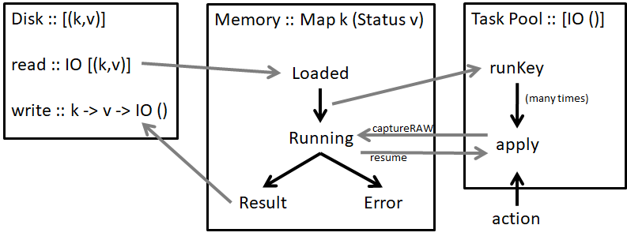

# Architecture

The theory behind Shake is documented in the [Build Systems a la Carte paper](https://ndmitchell.com/#shake_5_may_2019). The full code is [on GitHub](https://github.com/ndmitchell/shake). A high-level architecture diagram is:



**Data Storage**

At it's heart, the Shake "database" (not really a database) stores a mapping from keys (`k`) to values (`v`). That mapping is stored on disk as a list of `(k,v)` pairs. When Shake computes a new value for `k`, it appends it to the end of the file. When Shake starts, it loads the list, keeping only the last value for any given `k`, and producing a `Map k v`. On disk, each entry is prefixed by its size, so that if the file is truncated (e.g. machine shutdown), any trailing incomplete data can be discarded.

When operating in memory, Shake uses the data type `Map k (Status v)`, with the approximate definitions:

```
data Result v = Result
    {result :: v -- ^ the result associated with the Key
    ,built :: Step -- ^ when it was actually run
    ,changed :: Step -- ^ when it last changed
    ,depends :: [[Id]] -- ^ dependencies (Id is roughly key)
    }

data Status v
    = Loaded (Result v)
    | Running (Either SomeException (Result v) -> IO ())
    | Error SomeException
    | Ready (Result v)
```

Data is loaded in the `Loaded` state. When someone demands a key it moves to `Running` - anyone who subsequently demands it will be added to the callback. After the run completes it becomes either `Error` or `Ready`.

**Execution Model**

Shake runs values in the `Action` monad, which is a combination of some global state (e.g. settings), per-rule state (e.g. dependencies) and continuations, with IO underlying everything. The execution model of Shake is that every `Action` computation is either blocked waiting for a `Running` to complete, or queued/executing with the thread pool. The thread pool has a list of things to do and runs them in a given priority order, respecting parallelism constraints. Most threads start up, do a bit of work, block on a `Running` and leave it for another item in the thread pool to requeue them.

To pause a thread we use continuations, meaning the most important operation on `Action` (which isn't available to users!) is:

```
captureRAW :: ((Either SomeException a -> IO ()) -> IO ()) -> Action a
```

This function stops an `Action` in its tracks, resuming it when the continuation is called. One invariant of Shake, which is (sadly!) not tracked by the type system is that every continuation passed to `captureRAW` must be called exactly once.

The symmetry between `Running` and `captureRAW` is deliberate, and convenient.

To kick start the thread pool, the user specifies things to run with `action` - a Shake program completes when all those initial `action` calls have completed.

**Rules**

The final piece of the puzzle is what Shake actually _does_ to build a key. The core of Shake is abstract over the `k` and `v`, but Shake ships with an outer layer of around ten additional rule types -- the most important of which is files. Taking an idealised (and inefficient) file rule, we can think of it as mapping from file paths to file contents. To provide such a rule, we first declare the type mapping:

```
type instance RuleResult FilePath = String
```

And then declare the rule. The rule says how to take the key (the filename), whether its dependencies have changed, the old value (the old contents), and produce a new value (the current contents). In addition, the rule must say if the contents have changed in a meaningful way, which causes anyone who depended on them to rebuild.

Shake programs typically call `apply` which builds a list of keys in parallel, moving all the keys to `Loaded` (or at least one to `Error`) before continuing.
